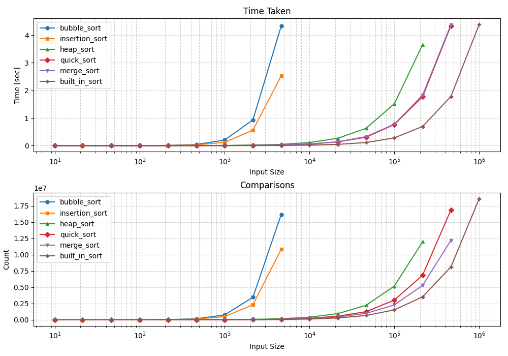

# sorting-algorithms

A collection of sorting algorithm implementations in Python with an evaluation script to compare them in terms of time taken and number of comparisons made to sort.

## What this repository contains

- `sorting_functions.py` — implementations of sorting algorithms.
- `evaluate.py` — simple script to run and compare the algorithms.
- `counted_comparison_type.py` — helper for counting comparisons (used by the evaluator).
- `results.png` — example output image from a sample run (included below).

The evaluator will run the implemented sorts on sample data and produce results. An example result image is embedded below.

## Results

## Notes

- Evaluation is stopped for an algorithm with longer inputs when a run takes longer than 2 seconds.

